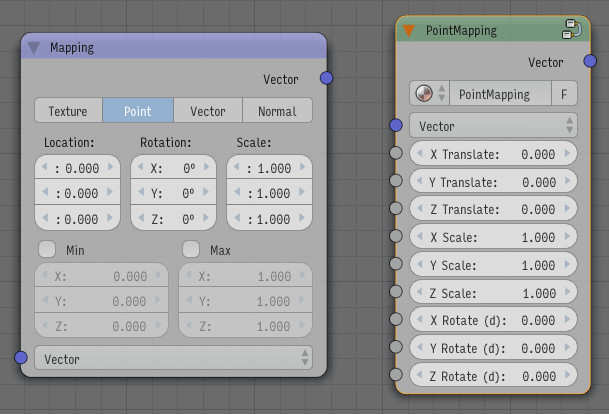
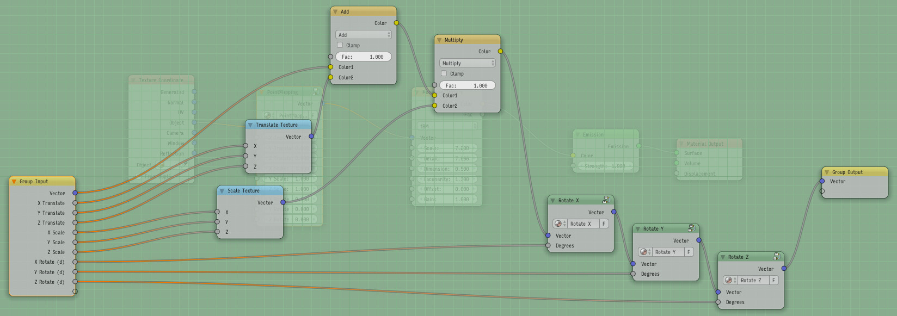
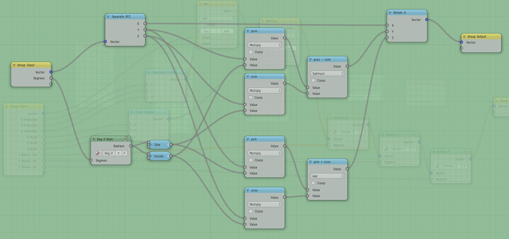

# Blender Mapping Node

This is a simple equivalent to the “Mapping” vector node in Blender (set to “Point”).

In contrast to the Mapping node, this node allows to map the location, rotation and scale parameters.

This can be used in a group or to input noise in the rotation, for example.

## How to use

1. In Blender, File > Append, enter the .blend file from this repository, the “NodeTree”, and select “PointMapping”;
2. in the node editor, Shift-A, Group, then PointMapping.

There are also groups that only do rotation around the X, Y, or Z axis.

## How it works

The transformations are applied in this order:

1. translate
2. scale
3. rotate around X
4. rotate around Y
5. rotate around Z

For the rotations, I used the same order as the Mapping node, so it should properly emulate it.

Here’s the Rotate X node as an example:

## Inspiration

[Rotation matrix on Wikipedia](https://en.wikipedia.org/wiki/Rotation_matrix)

## License

MIT. Do whatever you want with this.
